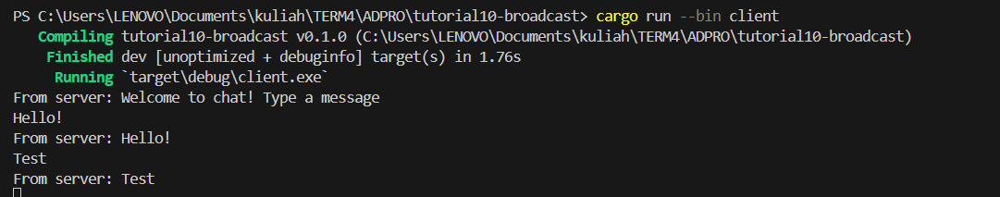
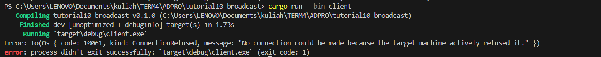

`Original code of broadcast chat`

When the server is initiated using cargo run --bin server and each client is started with cargo run --bin client, the server broadcasts messages received from any client to all connected clients. Therefore, whenever a client inputs a message, it is relayed by the server to every client in the network.

`Modifying the websocket port`

When both the client and server use the same port, the application functions smoothly. However, changing the port on just the client side leads to a connection error because the client attempts to connect to a port that isn't open, causing the program to crash when cargo run --bin client is executed.

I modified the way messages are broadcast to include both the sender's IP address and port along with the text message. Previously, the broadcast only contained the text, without identifying the sender's details